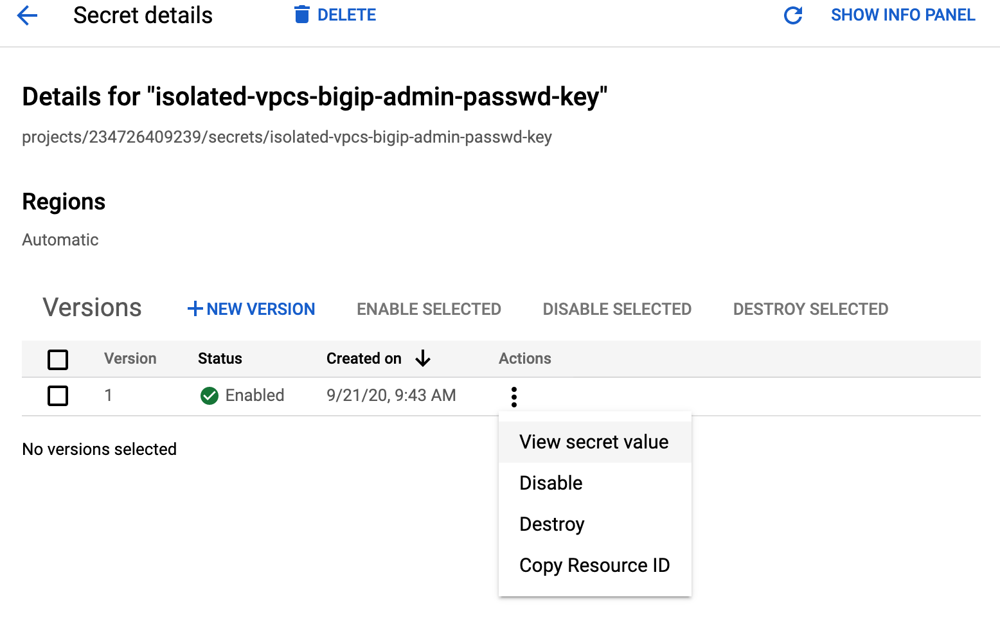
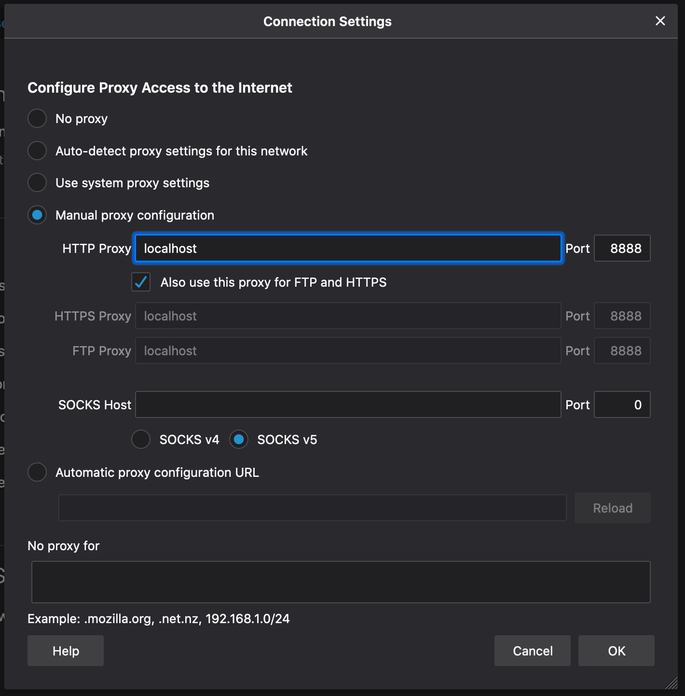
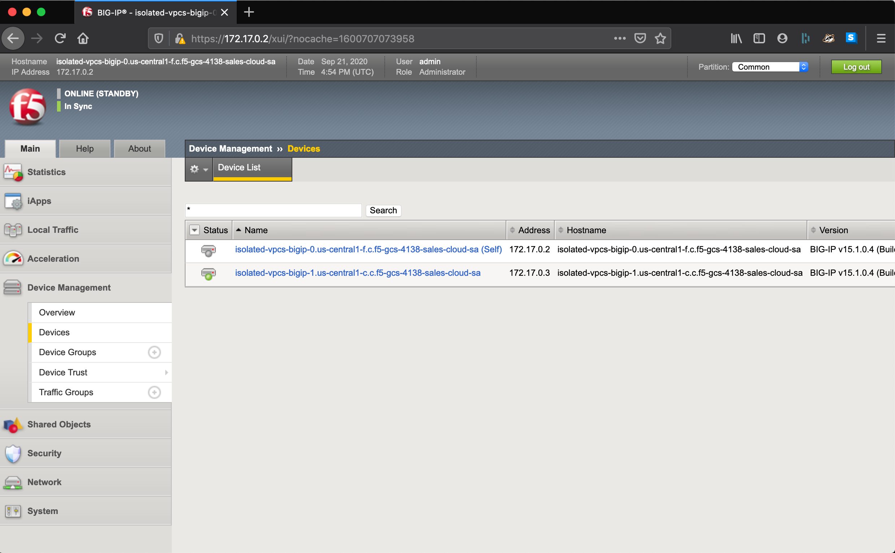

# Deploy BIG-IP in GCP without internet access


This repo contains sample Terraform to provision a BIG-IP HA cluster with CFE on
GCP where internet access is prohibited. The files will create a Cloud DNS
private zone to shadow `*.googleapis.com` with `restricted.googleapis.com`
endpoints, and install run-time libraries from a GCS bucket.

## Steps to execute

1. Create or prepare a GCS bucket, or other HTTP host on the private network that
   can supply Cloud Libraries and supporting files as needed by BIG-IP and bastion
   host.
2. Prepare Terraform config and variables setting files; you can make a copy of
   `env/emes` folder and modify the `base.config` and `base.tfvars` files to
   match your environment.
   * This repo assumes you have setup and enabled IAM impersonation for a
     Terraform service account; set `tf_sa_email` variable to empty string ("")
     to use your own credentials.
   * If you are using a GCS bucket to host RPMs, etc, use the scheme for encoding
     HTTP download requests as described at [Encoding URI path parts](https://cloud.google.com/storage/docs/request-endpoints#encoding).
3. Initialise and execute Terraform

   Using `emes` configuration as an example.

   ```shell
   terraform init -backend-config env/emes/base.config
   terraform apply -var-file env/emes/base.tfvars -auto-approve
   ```

   ```shell
   Apply complete! Resources: 52 added, 0 changed, 0 destroyed.

   Outputs:

   admin_password_key = projects/f5-gcs-4138-sales-cloud-sales/secrets/isolated-vpcs-bigip-admin-passwd-key
   bastion_name = isolated-vpcs-bastion
   bigip_addresses = {
     "isolated-vpcs-bigip-0" = {
       "external" = [
         "172.16.0.3",
         "172.16.0.4/32",
       ]
       "internal" = [
         "172.18.0.2",
       ]
       "management" = [
         "172.17.0.2",
       ]
       "vips" = [
         "172.16.0.4/32",
       ]
     }
     "isolated-vpcs-bigip-1" = {
       "external" = [
         "172.16.0.2",
       ]
       "internal" = [
         "172.18.0.3",
       ]
       "management" = [
         "172.17.0.3",
       ]
       "vips" = []
     }
   }
   cfe_label_value = isolated-vpcs
   ```

4. Wait for BIG-IPs to complete initialisation

   You can check initialisation status by viewing the serial console output of
   instances and verifying that the CFE declaration has been applied, as this is
   the final step in initialisation.

   ```shell
   gcloud compute instances get-serial-port-output --project f5-gcs-4138-sales-cloud-sales --zone us-central1-c isolated-vpcs-bigip-1 2>/dev/null | grep '/config/cloud/gce'
   ```

   ```shell
   2020-09-17T15:54:25.447-0700: /config/cloud/gce/initialSetup.sh: Info: Initialisation starting
   2020-09-17T15:54:25.451-0700: /config/cloud/gce/initialSetup.sh: Info: Generating /config/cloud/gce/network.config
   2020-09-17T15:54:25.610-0700: /config/cloud/gce/initialSetup.sh: Info: Waiting for mcpd to be ready
   2020-09-17T15:55:14.543-0700: /config/cloud/gce/multiNicMgmtSwap.sh: Rebooting for multi-nic management interface swap
   2020-09-17T15:56:00.021-0700: /config/cloud/gce/initialSetup.sh: Info: Initialisation starting
   2020-09-17T15:56:00.025-0700: /config/cloud/gce/initialSetup.sh: Info: Generating /config/cloud/gce/network.config
   2020-09-17T15:56:00.037-0700: /config/cloud/gce/initialSetup.sh: Info: Waiting for mcpd to be ready
   2020-09-17T15:56:27.580-0700: /config/cloud/gce/multiNicMgmtSwap.sh: Nothing to do
   2020-09-17T15:56:27.587-0700: /config/cloud/gce/initialNetworking.sh: Info: Waiting for mcpd to be ready
   2020-09-17T15:56:27.841-0700: /config/cloud/gce/initialNetworking.sh: Info: Resetting management settings
   ...
   2020-09-17T22:59:08.234+0000: /config/cloud/gce/customConfig.sh: Info: waiting for mcpd to be ready
   2020-09-17T22:59:08.959+0000: /config/cloud/gce/customConfig.sh: Info: Applying CFE payload
   2020-09-17T22:59:26.609+0000: /config/cloud/gce/customConfig.sh: Info: CFE declaration is applied
   2020-09-17T22:59:26.614+0000: /config/cloud/gce/initialSetup.sh: Info: Initialisation complete
   2020-09-17T22:59:26.620+0000: /config/cloud/gce/resetManagementRoute.sh: waiting for mcpd to be ready
   2020-09-17T22:59:27.051+0000: /config/cloud/gce/resetManagementRoute.sh: complete
   ```

5. Login and configure BIG-IP as needed

   In this demo, accessing the BIG-IP requires the use of the bastion host.
   Create an SSH tunnel through the bastion host and use tinyproxy to access
   instances.

   1. Retrieve the admin password from Secret Manager

      > NOTE: You will login as `admin` with the randomly generated password
      > stored in Google's Secret Manager.

      

   2. Create an IAP session for SSH to the bastion and tunnel between port 8888
   on local computer and bastion. Tinyproxy has been configured to be active on
   port 8888 too.

      ```shell
      gcloud compute ssh --project f5-gcs-4138-sales-cloud-sales --zone us-central1-f isolated-vpcs-bastion --tunnel-through-iap -- -A -L8888:127.0.0.1:8888
      ```

   3. Set your browser to proxy HTTP and HTTPS traffic through localhost:8888

      

   4. Login to a BIG-IP instance using `admin` account and password

      

## Clean up resources

1. Tear down the resources created in this demo

   ```shell
   terraform destroy -var-file env/emes/base.tfvars -auto-approve
   ```

2. Destroy any supporting GCS buckets or other reosources that were created
   outside of this repo

<!-- markdownlint-disable MD033 -->
<!-- BEGINNING OF PRE-COMMIT-TERRAFORM DOCS HOOK -->
## Requirements

| Name | Version |
|------|---------|
| terraform | ~> 0.12 |
| google | ~>3.39 |
| google | ~>3.39 |

## Providers

| Name | Version |
|------|---------|
| google | ~>3.39 ~>3.39 |
| google.executor | ~>3.39 ~>3.39 |
| random | n/a |

## Inputs

| Name | Description | Type | Default | Required |
|------|-------------|------|---------|:--------:|
| bastion\_zone | The GCE zone to deploy the bastion host. Default is 'us-central1-f'. | `string` | `"us-central1-f"` | no |
| bigip\_zones | The GCE zones to deploy the BIG-IP instances. Default is 'us-central1-f' and<br>'us-central1-c'. | `list(string)` | <pre>[<br>  "us-central1-f",<br>  "us-central1-c"<br>]</pre> | no |
| cfe\_label\_key | The CFE label key to assign to resources that are going to be managed by CFE.<br>Default value is 'f5\_cloud\_failover\_label'. | `string` | `"f5_cloud_failover_label"` | no |
| cfe\_label\_value | The CFE label value to assign to resources that are going to be managed by this<br>BIG-IP deployment. If left empty, a value will be generated for this deployment. | `string` | `""` | no |
| cloud\_libs\_bucket | An optional GCS bucket name to which the BIG-IP service account will be granted<br>read-only access. Default is empty string.<br><br>See `install_cloud_libs`. | `string` | `""` | no |
| image | The GCE image to use as the base for BIG-IP instances; default is latest BIG-IP v15 payg good 25mbs. | `string` | `"projects/f5-7626-networks-public/global/images/f5-bigip-15-1-0-4-0-0-6-payg-good-25mbps-200618231522"` | no |
| install\_cloud\_libs | Contains the URLs for F5's Cloud Libs required for BIG-IP w/CFE on-boarding,<br>overriding the default download patch from cdn.f5.com and github.com. | `list(string)` | n/a | yes |
| install\_tinyproxy\_url | Contains the URL for tinyproxy RPM to install on bastion host. | `string` | n/a | yes |
| labels | An optional map of label key-values to apply to all resources. Default is an<br>empty map. | `map(string)` | `{}` | no |
| prefix | An optional prefix to use when naming resources; default is 'isolated-vpcs'.<br>Override this value if you are deploying in a shared environment. | `string` | `"isolated-vpcs"` | no |
| project\_id | The existing project id that will host the BIG-IP resources. | `string` | n/a | yes |
| tf\_sa\_email | The fully-qualified email address of the Terraform service account to use for<br>resource creation. E.g.<br>tf\_sa\_email = "terraform@PROJECT\_ID.iam.gserviceaccount.com" | `string` | `null` | no |
| tf\_sa\_token\_lifetime\_secs | The expiration duration for the service account token, in seconds. This value<br>should be high enough to prevent token timeout issues during resource creation,<br>but short enough that the token is useless replayed later. Default value is 1200. | `number` | `1200` | no |

## Outputs

| Name | Description |
|------|-------------|
| admin\_password\_key | The name of the Secret Manager key that contains the generated admin password. |
| bastion\_name | The name of the bastion VM. |
| bigip\_addresses | The set of IPv4 addresses and CIDRs assigned to the BIG-IP instances. |
| cfe\_label\_value | The CFE-specific label that has been applied to CFE related resources. |

<!-- END OF PRE-COMMIT-TERRAFORM DOCS HOOK -->
<!-- markdownlint-enable MD033 -->
